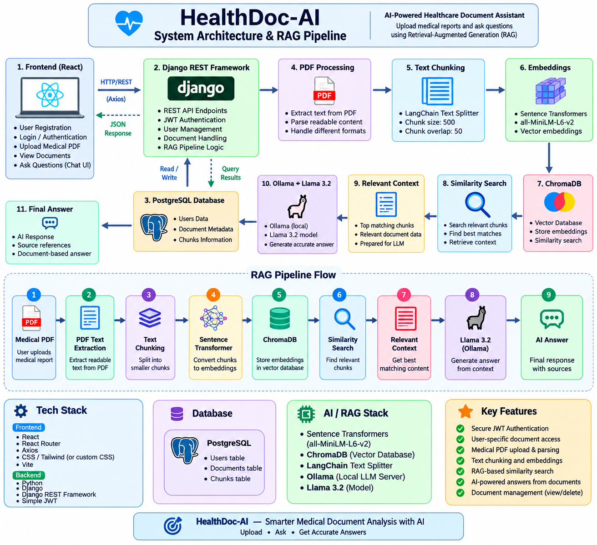

# HealthDoc-AI

HealthDoc-AI is an AI-powered healthcare document assistant that allows users to upload medical PDF reports and ask questions about their documents using Retrieval-Augmented Generation (RAG).

## Features

- User registration and login
- JWT-based authentication
- User-specific document access
- Medical PDF upload
- PDF text extraction
- Text chunking
- Sentence Transformer embeddings
- ChromaDB vector database
- RAG-based similarity search
- Ollama + Llama 3.2
- Document-specific AI chat
- Document listing and deletion
- Protected API endpoints
- Healthcare-focused React UI
- Loading and error handling

## Tech Stack

### Frontend

- React
- React Router
- Axios
- CSS
- Vite

### Backend

- Python
- Django
- Django REST Framework
- Simple JWT

### Database

- PostgreSQL

### AI / RAG

- Sentence Transformers
- ChromaDB
- LangChain Text Splitter
- Ollama
- Llama 3.2

## System Architecture

```text
React Frontend
      |
      | REST API
      v
Django REST Framework
      |
      +----------------------+
      |                      |
      v                      v
 PostgreSQL            PDF Processing
                             |
                             v
                       Text Extraction
                             |
                             v
                       Text Chunking
                             |
                             v
                         Embeddings
                             |
                             v
                          ChromaDB
                             |
                             v
                      Similarity Search
                             |
                             v
                     Relevant Context
                             |
                             v
                     Ollama / Llama 3.2
                             |
                             v
                           Answer

How It Works
User registers or logs into the application.
JWT authentication protects private API endpoints.
The user uploads a medical PDF report.
Django extracts readable text from the PDF.
The extracted text is divided into smaller chunks.
Text chunks are converted into vector embeddings.
Embeddings are stored in ChromaDB.
The user selects a document and asks a question.
The system performs similarity search against the selected document.
Relevant document context is retrieved.
The retrieved context is sent to Llama 3.2 through Ollama.
The AI generates an answer based on the retrieved document context.
Security

HealthDoc-AI implements user-based document access control.

Each uploaded document belongs to the authenticated user. Protected API endpoints verify the authenticated user before allowing access to documents.

Users cannot:

View another user's documents
Delete another user's documents
Ask questions about another user's documents

JWT authentication is used to protect private API endpoints.

Project Structure
HealthDoc-AI/
│
├── backend/
│   ├── config/
│   ├── documents/
│   ├── users/
│   ├── postman/
│   ├── manage.py
│   └── requirements.txt
│
├── frontend/
│   ├── public/
│   ├── src/
│   │   ├── components/
│   │   ├── pages/
│   │   ├── services/
│   │   ├── App.jsx
│   │   └── main.jsx
│   ├── package.json
│   └── vite.config.js
│
├── .gitignore
└── README.md

API Endpoints
Method	Endpoint	Description
POST	/api/register/	Register a new user
POST	/api/token/	Login and obtain JWT tokens
POST	/api/token/refresh/	Refresh JWT access token
GET	/api/profile/	Get authenticated user profile
GET	/api/documents/	List user's documents
POST	/api/documents/upload/	Upload a medical PDF
DELETE	/api/documents/<id>/	Delete user's document
POST	/api/documents/chat/	Ask a question about a document


RAG Pipeline
Medical PDF
     ↓
PDF Text Extraction
     ↓
Text Chunking
     ↓
Sentence Transformer
     ↓
Vector Embeddings
     ↓
ChromaDB
     ↓
Similarity Search
     ↓
Relevant Context
     ↓
Llama 3.2
     ↓
AI Answer


Installation
Backend
cd backend

python3 -m venv venv
source venv/bin/activate

pip install -r requirements.txt

Run Django:

python manage.py runserver
Frontend

Open another terminal:

cd frontend

npm install
npm run dev
Environment Variables

Create a .env file for sensitive configuration.

Example:

SECRET_KEY=your_secret_key
DATABASE_NAME=your_database_name
DATABASE_USER=your_database_user
DATABASE_PASSWORD=your_database_password
DATABASE_HOST=localhost
DATABASE_PORT=5432

Never commit real secrets or passwords to GitHub.

Future Improvements
Conversation history
Multiple document comparison
Streaming LLM responses
Medical document preview
Cloud deployment
Role-based access control
Production monitoring
Improved medical document parsing
Disclaimer

HealthDoc-AI is an AI-powered document assistant designed to help users understand information contained in uploaded documents.

It is not a replacement for a qualified medical professional and should not be used for medical diagnosis or treatment decisions.

